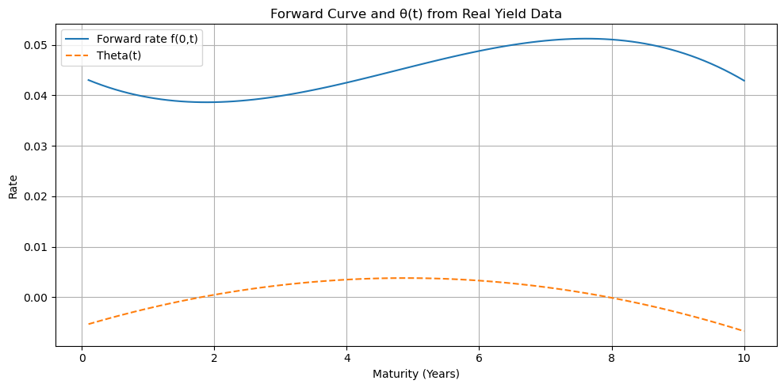

# Hull-White Interest Rate Strategy Lab

A robust Python framework for modeling, simulating, and analyzing interest rate dynamics using the Hull-White model.

---

## 📊 Visual Examples

### 1. Forward curve & θ(t)  

### 2. Hull-White simulated rate paths  

### 3. Strategy metrics  

### 4. Rolling sharp ratio

### 5. Rolling volatility  

### 6. Clustering K-means  

### 7.   

### 8. Feature means by K-means  

*📌 Place your generated `.png` files in an `images/` folder.*  

---

## 🌍 Features

- 📡 Calibration to real U.S. Treasury yield curve data (via FRED API)  
- 📈 Simulation of short rates via Hull-White model, including θ(t)  
- 🧮 Calculation of zero-coupon bond prices, A(t,T), B(t,T), & forward curves  
- 🧠 Signal generation with regime-based clustering (PCA + KMeans)  
- 📊 Key performance metrics: Sharpe, drawdown, rolling volatility  
- 🧪 Backtesting of model-driven strategies, exportable signals

---

## 📚 Use Cases

- Quant research on interest rate dynamics  
- Intraday/swing strategies for prop trading using rate instruments  
- Fixed income or macro portfolio strategy design  
- Teaching models in financial engineering  

---

## 📦 Requirements

- Python 3.8+  
- `pandas`, `numpy`, `matplotlib`, `seaborn`  
- `scipy`, `sklearn`, `statsmodels`  
- `yfinance`, `fredapi`
